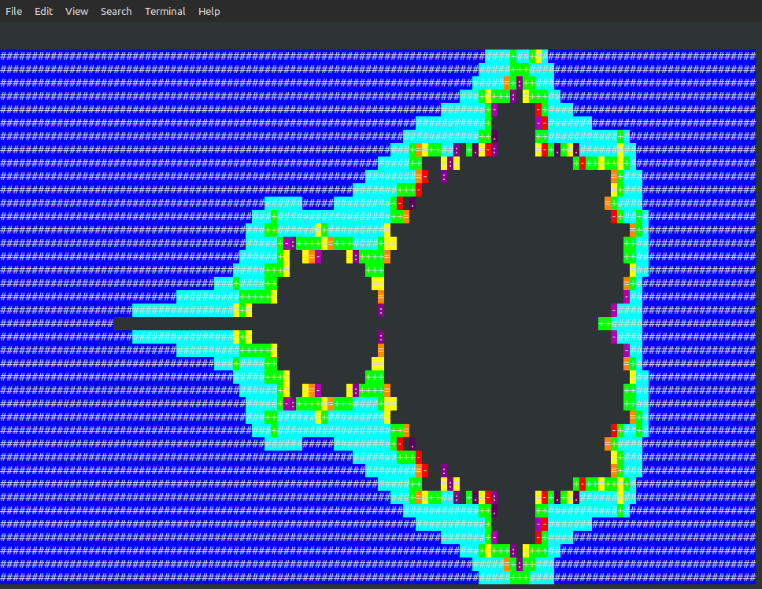

# Mandelbrot Set - ASCII with Colors in Ada

A colorful ASCII art renderer of the Mandelbrot set, written in Ada for Linux terminals.




## Features

- Renders the Mandelbrot set using ASCII characters
- Uses ANSI 256-color codes 
- Written in Ada 
- Configurable resolution and bounds

## Requirements

- Ada compiler (GNAT)
- Linux terminal with 256-color support

## Compilation

```bash
gnatmake mandelbrot.adb
```

## Running

```bash
./mandelbrot
```

## Customization

- `Width` and `Height`: Terminal resolution (default: 120x40)
- `X_Min`, `X_Max`, `Y_Min`, `Y_Max`: Complex plane bounds
- `Max_Iter`: Maximum iterations (higher = more detail, slower)

## Color Legend

- **Blue/Cyan**: Quick escape (outside set)
- **Green/Yellow/Orange**: Medium escape time
- **Red/Purple**: Slow escape (near the set boundary)
- **Black**: Inside the set (never escapes)

